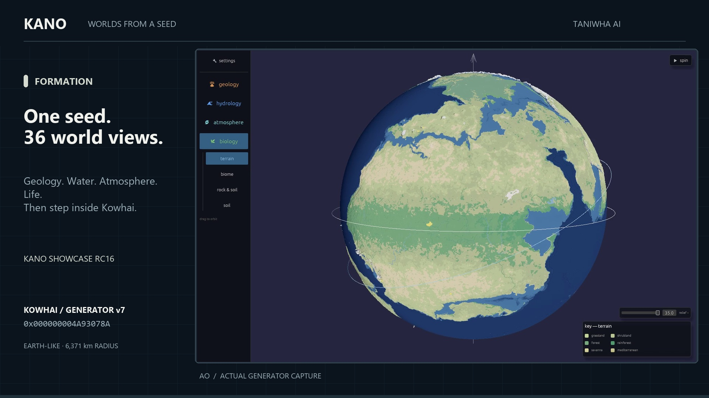
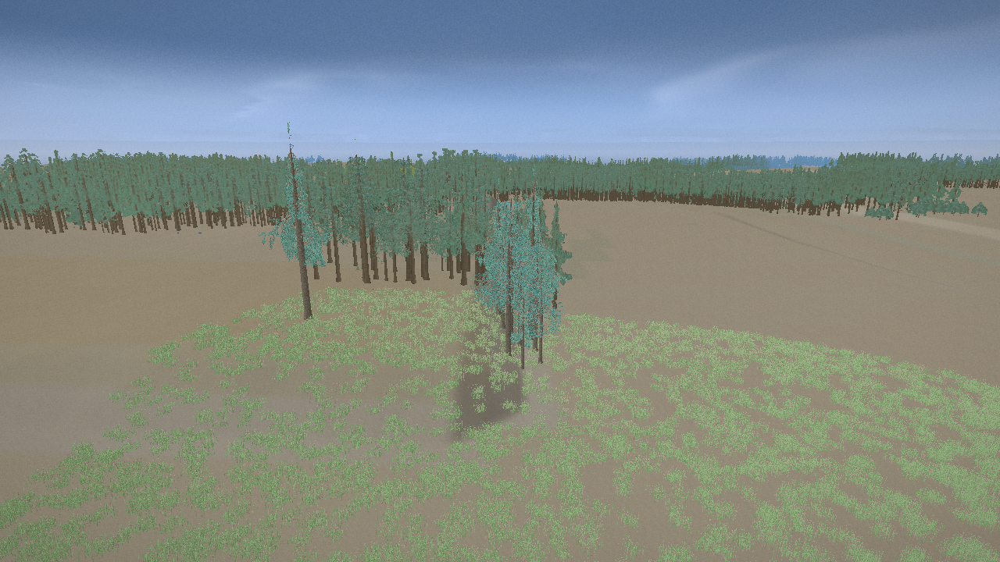
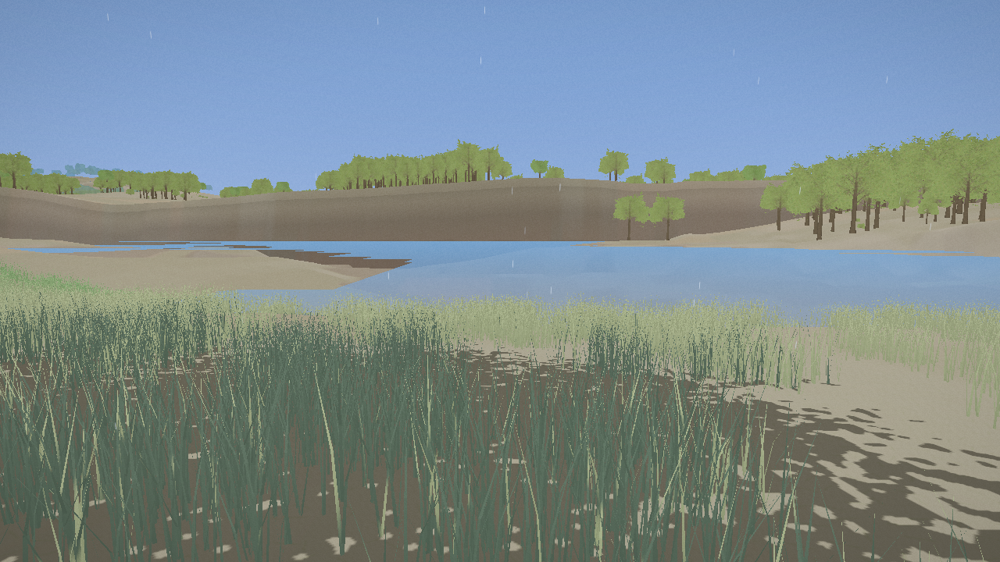

# Kano Showcase

**Walk a generated world. Then ask it why.**

**[Watch: From a seed to a world · 1:44](https://taniwha.ai/kano#world-film)**
· [Download the full film · 1080p MP4](https://github.com/taniwhaai/kano-showcase/releases/download/v0.1.0-rc16/kano-seed-to-world-1080p.mp4)

See Kowhai generated from a hexadecimal seed, explore all 36 views of its
geology, water, atmosphere and life, then descend from orbit into the landscape.
Recorded directly in Kano's World Builder and Hīkoi; the formation sequence
is accelerated. The World Builder is demonstrated in the film; the download
below contains the finished world, viewer and MCP server.

Kowhai is an Earth-sized world with **28.37% land**. Explore a river meadow,
low coastal ground, rainy forest, open woodland, cool taiga and a snow plateau
in **Hīkoi**, the first-person viewer. Ask the world about its geology,
climate, soil and life without an account, network connection or AI.

Download the self-contained bundle for your platform from
[Releases](https://github.com/taniwhaai/kano-showcase/releases). Unzip the whole
folder and run `hikoi`; keep the world, flora pack and documentation together.
RC16 introduces Kowhai. Earlier releases contain the Rata world and different
coordinates.

*RC16, at local daylight and initial world age. Captured directly
from Hīkoi with the bundled flora pack on NVIDIA RTX 3080 / Vulkan. Weather
and lighting change with the clock; distant vegetation uses the portable
256 px tiles included in the download.*

## Start exploring

1. **WASD** moves, **mouse** looks, and **Shift** moves faster.
2. **I** asks about the landscape; **right mouse** inspects a plant's recipe.
3. Click **Explore the world**, or press **J**, for a three-stop tour. **N**
   skips ahead; **K** pauses/resumes; **J** ends it. Each stop waits for its
   scene to load, then stays for a minute. The tour advances the clock to
   local daylight.
4. **F** flies or lands. **E/C** climbs or descends while flying. Some curated
   places begin above the ground so you can see the landscape immediately.
5. **Tab** opens Places; **1–7** travels to a stop. **G** opens the globe.
   **M** opens the map; **R** toggles the grid. **Esc** closes panels and frees
   the pointer; **Q** opens quit confirmation.

The **Controls** window opens at startup and can be reopened with **F1** or
the Controls button. It lists all keys and offers clock-speed controls.
The default clock is 60×; choose **Real time · 1×** to slow it, or press **T
twice** from the default after closing Controls. **P** pauses/resumes time.

Terrain and vegetation build as you arrive. The included flora pack saves
repeated vegetation work at the curated stops; the wait still depends on
your machine. A missing or rejected pack falls back to live generation.

See [Places](PLACES.md) for all seven stops and their coordinates.

## Visit a running world

The viewer's **Visit Copperhollow** link opens
[the running settlement](https://copperhollow.taniwha.ai) in your browser.
Look around and inspect the settlement through its visitor view. It is a
separate simulation from the offline Kowhai download; this release does not
replace or redeploy it. The visitor experience requires a network connection.

## Bring your own AI

The bundle includes `kano`, a local MCP server over the same saved world.
Follow [Connect your AI](docs/connect-your-ai.md), then ask:

- “What grows at -3.14739, -19.03260, and why?”
- “Explain this region from geology through water, soil and life.”
- “Find somewhere nearby where a mine would make geological sense.”

These answers come from the world's fields. Broad location queries describe
regional conditions; local terrain and shorelines are finer than a regional
elevation reading. Use the viewer to inspect the exact walking surface.

## Requirements

A Vulkan, Metal or DX12-class GPU with current drivers and at least **4 GB
of graphics or shared memory**; **8 GB system RAM is recommended**. A Windows
RTX 3080 / Vulkan capture of the rainy forest at 1280×720 peaked at 2.75 GiB
of viewer working memory, before allowing room for the OS and graphics
allocations. Linux builds target Ubuntu 22.04 (glibc 2.35) or a newer
compatible runtime, with Vulkan drivers. The indexed
terrain path used by Metal and DX12 now draws from the same dense ground
field as Vulkan, with detail reducing away from the card centre. Lighting,
water and distant detail can vary by backend. The included distant vegetation
tiles use a portable 256 px resolution.

The builds are unsigned:

- **Windows:** SmartScreen may warn; choose *More info → Run anyway*.
- **macOS:** right-click → *Open*. If needed, remove quarantine from both
  programs with `xattr -d com.apple.quarantine hikoi kano`.
- **Linux:** use `chmod +x hikoi kano` if needed.

## About the download

This is one fixed, pre-generated world. It has Earth-like land and water
proportions, but its coordinates belong to Kowhai. The generator and audio
are not included.

- [Controls](docs/controls.md)
- [Interrogating the world](docs/interrogating-the-world.md)
- [Connect your AI](docs/connect-your-ai.md)
- [Troubleshooting](docs/troubleshooting.md)
- [Support](SUPPORT.md) · [Security](SECURITY.md)

Free to download and use; no redistribution. See [LICENSE.md](LICENSE.md).
Please point people to this repository's releases.

Kano and Hīkoi are made by [Taniwha AI](https://taniwha.ai).
