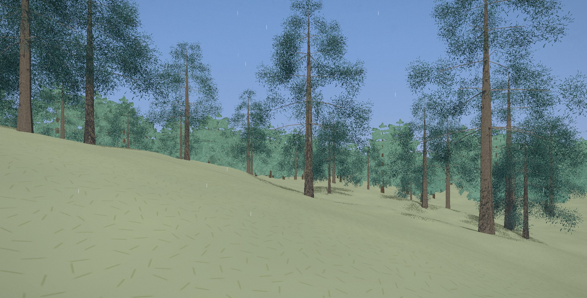
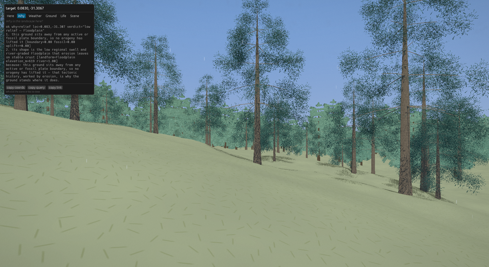
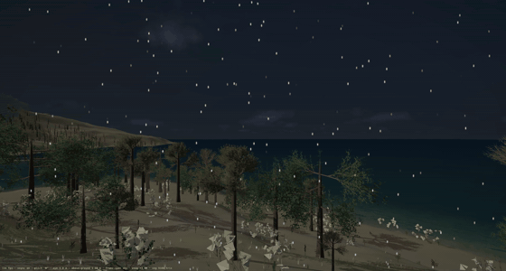

# Kano Showcase

**Walk a generated world. Then ask it *why*.**

> **Note on the imagery below:** these stills and the video were captured in
> July 2026 on an *earlier* showcase world. Since `rc12` the shipped world is
> **rata**, which looks different — most visibly, rata has no vegetated
> coastline, so the night-coast clip is not a place you can walk to in the
> current download. The captures still show real, unretouched Hīkoi output and
> the same generator; they are simply not the planet in the current release.
> Fresh imagery is being shot.
>
> **They were also shot on a high-end GPU.** Vegetation beyond the
> full-detail band is drawn from pre-rendered impostor tiles whose resolution
> is picked to fit your card's memory class: integrated graphics get the
> coarsest tier (256 px), discrete cards 512–1024 px depending on how many
> species the place holds. So the *far field* is sharper in our captures than
> it will be on a laptop. What grows, where, and how much of it is identical
> on every machine — only the distant detail scales.

Kano grows whole planets from a single seed — geology, climate, hydrology,
weather, life — every place coherent enough to explain why it's there. This
showcase is one such world, plus **Hīkoi**, a first-person viewer that lets
you walk it and interrogate it: point at a ridge and the world itself tells
you the tectonic story that raised it. No account, no network, no AI required
— and if you *do* bring your own AI, it can query the exact same world over
MCP.

> Downloads are on the **[Releases page](../../releases)** — binaries and the
> world file are release assets, not repository files.

## 60-second start

1. Download the zip for your platform from [Releases](../../releases).
2. Unzip anywhere. Run `hikoi` (double-click). You're standing on the world.
3. Walk: **WASD** (+**Shift** to run) · look: **mouse** · interrogate what
   you're facing: **I** · a tree's generative recipe: **RMB** · globe travel:
   **G** · curated places: **1–8**.

The scene builds as you arrive: the terrain draws first, then the vegetation
fills in behind it. Since `rc8` the bundle ships a pre-baked flora pack, so
plants appear in under a second at the spawn and at every curated place —
the long waits for dense growth described in earlier notes are gone.

*Night snowfall over a coastal forest at −39.21, 129.07 — **on the pre-`rc12`
world**, not the currently shipped `rata` (which has no vegetated coastline).
Click through for the [full-quality clip](docs/media/hikoi-coastal-pan.mp4).*

First-run notes (unsigned builds):
- **Windows:** SmartScreen may warn — *More info → Run anyway*.
- **macOS:** right-click → *Open* (or `xattr -d com.apple.quarantine hikoi`).
- **Linux:** `chmod +x hikoi` if needed. Requires Vulkan-capable drivers.

## Ask the world questions — with your own AI

The bundle includes `kano`, a local MCP server over the same world file. Two
minutes of setup connects Claude (or any MCP client) to the world you're
walking: see **[CONNECT-YOUR-AI.md](docs/connect-your-ai.md)**.

Then ask things like:

- *"Explain this valley — from tectonics through hydrology to vegetation."*
- *"Prospect: find somewhere within 100 km where a mine would make geological
  sense, and justify it."*
- *"What grows here? Tell me one plant's life story."*
- *"Show me the strangest places on this world."*

The answers aren't generated commentary about a screenshot — the viewer and
the AI read the **same deterministic world**, so what you see and what it
says always agree.

## What this is (and isn't)

- One fixed, pre-generated world. The **generator is not included** — this
  showcase interrogates a world; it does not create them.
- Not Earth. Coordinates are lat/lon on this planet, not ours.
- Deterministic: the same file yields the same world, everywhere, forever.

## Documentation

- [Controls](docs/controls.md)
- [Interrogating the world](docs/interrogating-the-world.md)
- [Connect your AI (MCP setup)](docs/connect-your-ai.md)
- [Troubleshooting + known-good GPUs](docs/troubleshooting.md)
- [Support](SUPPORT.md) · [Security](SECURITY.md)

## License

Free to download and use; no redistribution — see [LICENSE.md](LICENSE.md).
Point people here rather than re-hosting the files.

---

*Kano and Hīkoi are made by [Taniwha AI](https://taniwha.ai).*
